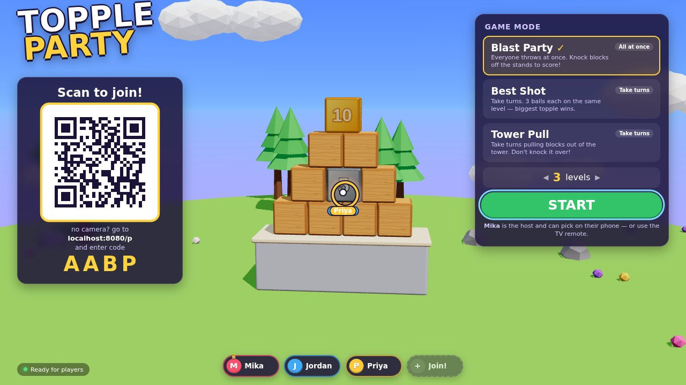
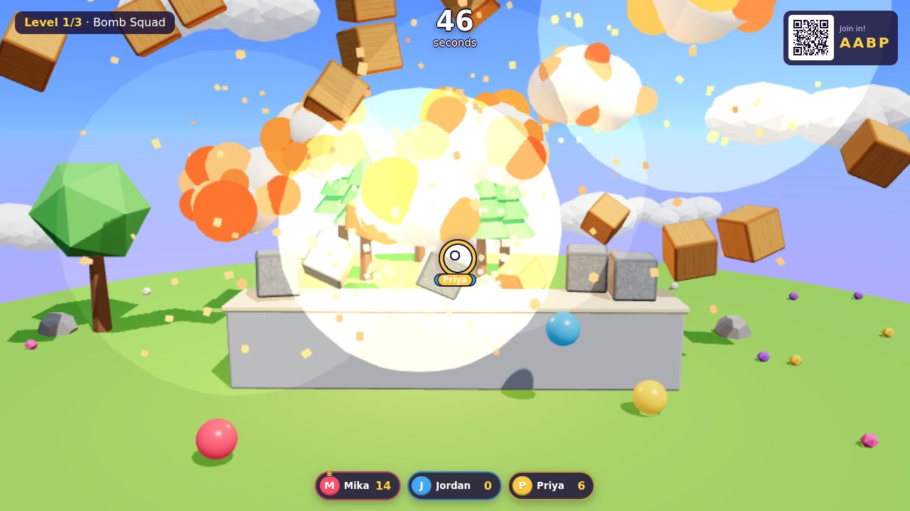
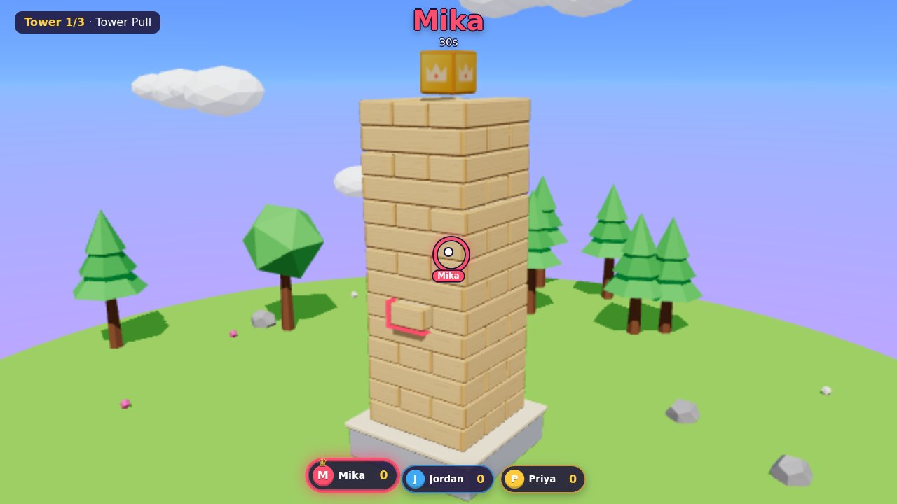
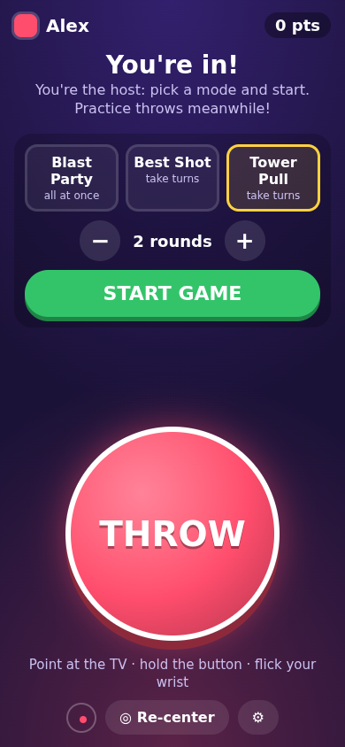

# Topple Party

A Boom Blox–style party game for **Android TV** where everyone's **phone is the controller**.
Players scan a QR code on the TV, then point their phone at the screen like a Wii remote and
**flick their wrist to throw**. Knock blocks off their stands, set off bombs, and pull blocks out
of a wobbly tower without toppling it.



| Blast Party | Tower Pull | Phone controller |
| --- | --- | --- |
|  |  |  |

## Game modes

| Mode | Style | How it works |
| --- | --- | --- |
| **Blast Party** | Everyone at once | Timed levels. Knock blocks off their stands; whoever's ball knocked it gets the points. Gold = 10, Gem = 25, Skull = −10. |
| **Best Shot** | Take turns | Everyone gets 3 balls on an identical copy of the level. Biggest topple wins the round. |
| **Tower Pull** | Take turns | Jenga-style. Aim at a block, hold **GRAB**, and slide your thumb (or tilt the phone) the way it should go to pull it out. Some blocks are loose, some are stuck. There's no time limit, but you can't pass: your turn only ends when a block comes all the way out. Drop the crown and you lose 15 points. On your turn, the **camera pad** on your phone turns the tower (drag ↔), looks higher/lower (drag ↕) and zooms (pinch or ＋/−). |

Special blocks: **bombs** (explode on a hard knock), **chemical** blocks (explode when two touch),
**ghost** blocks (vanish when hit), **ice** (slippery), **stone** (heavy).

## Controls (phone)

* Hold the phone like a TV remote, top edge pointing at the TV. On joining, tap **I'm pointing at it!**
  while aiming at the middle of the screen. Tap **◎ Re-center** any time the pointer drifts.
  (Holding it upright like a camera works too; re-center in that grip.)
* **Throw:** hold the big button and flick your wrist toward the TV. Harder flick = faster ball.
  A quick tap lobs a gentle ball.
* **Grab (Tower Pull):** hold **GRAB** on a block, then slide your thumb (or tilt the phone) the
  way you want the block to go, as seen on the TV: down/back = toward you, up = away, left/right =
  left/right. Blocks only slide along their length; arrows on the TV show the two ways the grabbed
  block can move.
  Use the **camera pad** above the button to get a better angle first. On the TV remote, the
  arrow keys move the camera too.
* No motion sensors? ⚙ → **Aiming: Touch pad**, then drag to aim and hold-and-release to throw.
* The controller stays upright while you swing the phone. On Android, tapping JOIN switches to
  full screen with portrait locked. On iPhone (or after leaving full screen), the page turns itself
  back if the phone auto-rotates. You can turn this off in ⚙ (**Keep the screen upright**).
* The first player to join is the **host** (♛) and picks the mode on their phone. The TV remote works too.

## Setting it up

The game is a web app hosted on GitHub Pages. The Android TV app is a thin full-screen WebView that
opens it, so game updates only need a `git push`, not a new APK.

1. **Create the repo.** On GitHub, make a new repository called `topple-party` under your account
   and push this folder to its `main` branch:
   ```sh
   git init && git add -A && git commit -m "Topple Party"
   git branch -M main
   git remote add origin https://github.com/penguin-grenade/topple-party.git
   git push -u origin main
   ```
2. **Turn on Pages.** Repo → **Settings → Pages → Build and deployment → Source: GitHub Actions**.
   Then re-run the **Build & deploy** workflow (Actions tab), or just push again.
3. **Try it in a browser.** When the workflow finishes, open
   <https://penguin-grenade.github.io/topple-party/> on a computer. Scan the QR code with your phone.
4. **Install the TV app.** Use `TopplePartyTV.apk` (included, or downloadable from
   `https://penguin-grenade.github.io/topple-party/TopplePartyTV.apk` after the first deploy):
   * **Easiest:** install the free *Downloader* app on the TV, enter that URL, and install.
     (Allow "Install unknown apps" for Downloader when asked.)
   * **Or with adb:** enable Developer options + USB/network debugging on the TV, then
     `adb connect <tv-ip>` and `adb install TopplePartyTV.apk`.
5. Launch **Topple Party** from the TV's app row and scan the QR code with your phones.

If you fork/rename the repo, the workflow builds an APK pointing at *your* Pages URL automatically
(grab it from the Actions run's artifacts or from `<your pages url>/TopplePartyTV.apk`).
If the TV app can't reach the game it shows a screen where you can edit the URL with the remote.

### TV remote

Arrows move, **OK** selects, **Back** pauses / goes back. In the lobby: pick a mode, set the
number of rounds with ◀ ▶, then **START**. `M` on a keyboard toggles sound, `F` toggles full screen.
Pointer remotes (LG Magic Remote, Samsung's cursor) and mice can click every card and button.

## Playing in a smart TV's web browser (no app needed)

Any TV (or streaming stick, console, or laptop plugged into the TV) with a modern enough browser
can run the game straight from the web page:

1. Open **<https://penguin-grenade.github.io/topple-party/>** in the TV's browser (Samsung Internet
   on Tizen, the LG webOS browser, Silk on Fire TV, and so on). Bookmark it; typing URLs with a remote
   is no fun.
2. Click **Full screen** (bottom right), or press `F` on a keyboard.
3. Press OK or click once so the browser allows sound.
4. Phones scan the QR code as usual.

The remote's **Back** button pauses the game instead of leaving the page.

**Requirements:** WebGL 2, WebAssembly, and WebRTC in a roughly Chrome 75-level browser engine. That
usually means TVs from about 2020–2021 onward. If a browser is too old, the page says what's
missing instead of showing a blank screen. This hasn't been tested on real TVs yet, and some TV
browsers may block WebRTC (phones then can't connect); the Android TV app avoids that.

## How the networking works

* The TV page creates a room on the free public [PeerJS](https://peerjs.com) broker
  (`0.peerjs.com`) and shows a QR code with a 4-letter room code.
* Phones open `…/p/#CODE`, and the broker only brokers the handshake. After that, phone and TV talk
  directly over a WebRTC data channel on your local network (with PeerJS's TURN relay as a fallback
  on networks that block device-to-device traffic).
* The controller page must be served over **HTTPS**, because phones only expose motion sensors to
  secure pages. GitHub Pages takes care of that.
* Internet is needed for the handshake (and fonts). A dropped phone reconnects automatically and keeps
  its score and color.
* If every player leaves mid-game, the game freezes and the TV counts down 10 seconds for someone to
  rejoin, then ends and goes back to the lobby.

**Self-hosting the broker (optional):** run `npm run signal` (starts a PeerJS server on port 9000)
and open the TV page with `?peerHost=<host>&peerPort=9000&peerSecure=0`. The QR code passes those
settings on to the phones.

## Development

```sh
npm install
npm run dev          # http://localhost:5173
```

* `http://localhost:5173/?local` runs without the network: open the phone page from the QR link in
  another tab of the same browser (it uses BroadcastChannel).
* Press **K** on the TV page to add a **mouse player** (move to aim, hold and release to throw;
  in Tower Pull hold on a block and drag down).
* `npm run dev:https` serves over HTTPS with a self-signed certificate, so real phones on your Wi-Fi
  can use motion sensors against your dev machine (accept the certificate warning once).
* **F2** toggles an FPS / render-scale readout. Rendering resolution adapts automatically to keep weak
  TV GPUs smooth.
* `npm run build` type-checks and outputs the static site to `dist/`.
* `npm run test:physics` runs headless physics checks: every level must stand still when untouched,
  sample throws, and Tower Pull block-pulling behaviour.

### Project layout

```
index.html            TV page (lobby, HUD, results)
p/index.html          phone controller page
src/shared/           protocol, networking (PeerJS / BroadcastChannel), QR encoder
src/controller/       phone: motion.ts (pointer + flick detection), main.ts (UI)
src/tv/sim/           physics (Rapier): blocks, levels, explosions, scoring, Tower Pull grab
src/tv/render/        three.js scene, procedural textures, particles
src/tv/game.ts        players, lobby, networking glue, TV remote input
src/tv/modes.ts       Practice, Blast Party, Best Shot, Tower Pull
android/              Android TV app (WebView wrapper, Gradle project)
.github/workflows/    builds the site + APK and deploys to GitHub Pages
```

Adding a level: add an entry to `LEVELS` in `src/tv/sim/levels.ts`. Builders like `b.plinth`,
`b.column`, `b.row`, `b.pyramid` and `b.pyramid3d` place blocks; anything that falls below its
stand's top scores.

## Android app details

* Package `io.github.penguingrenade.toppleparty`, min Android 5.0, shows in the Android TV / Google TV
  launcher (leanback banner) and also installs on phones/tablets.
* The game URL lives in `android/app/src/main/java/.../Config.java` (the workflow rewrites it).
* Open `android/` in Android Studio to build it yourself.
* **Signing:** CI builds are signed with a throwaway debug key unless you add repo secrets
  `TOPPLE_KEYSTORE_BASE64` (base64 of a `.jks` with key alias `topple`) and
  `TOPPLE_KEYSTORE_PASSWORD`. Use the same key every time if you want TV app updates to install
  over the old version. Otherwise uninstall the old one first.

## Troubleshooting

* **Phone says "No game found":** check the 4-letter code; the TV must show "Ready for players".
* **Stuck on "Connecting…" / "Reconnecting…":** the phone and TV both need internet. Some guest
  Wi-Fi networks block devices from talking to each other. The TURN fallback usually handles that,
  but a phone hotspot or home network is more reliable.
* **Pointer doesn't move (iPhone):** allow Motion & Orientation access when prompted. If you denied
  it, reload the page. **Firefox on Android** has limited sensor support, so use Chrome.
* **Pointer drifts:** aim at the middle of the TV and tap **◎ Re-center**. Adjust sensitivity in ⚙.
* **Choppy on the TV:** the game lowers its render resolution automatically. Press **F2** with a
  keyboard to see FPS.
